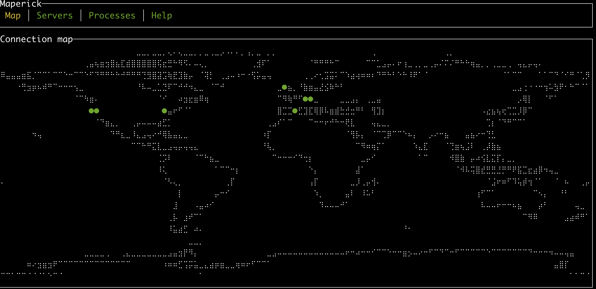
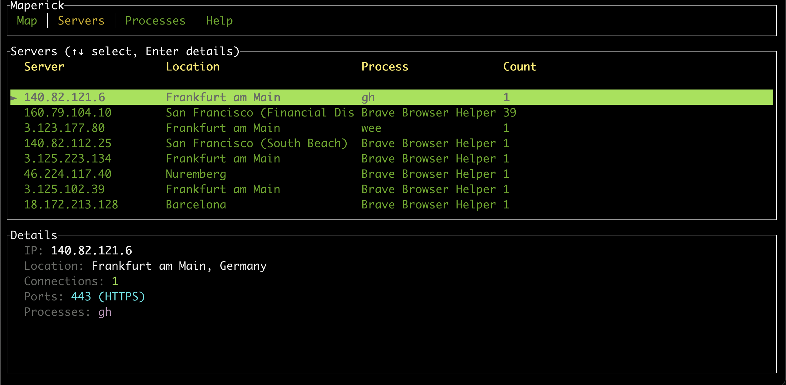
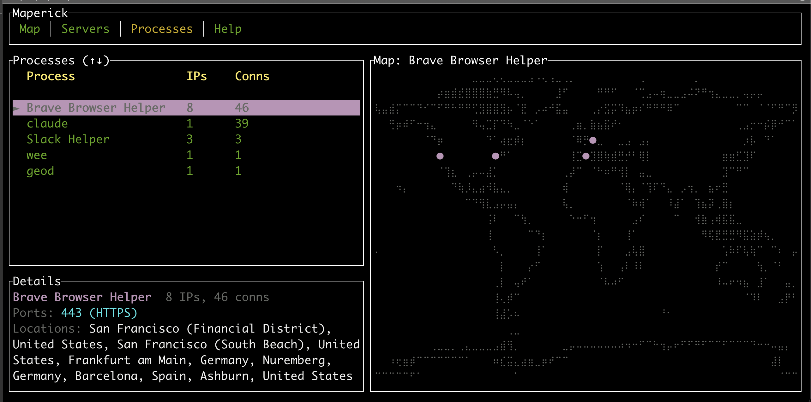

# Maperick

[](https://github.com/schlunsen/maperick/actions/workflows/ci-tests.yml)
[](LICENSE)

**Visualize your active TCP connections on a world map — right in your terminal.**

Maperick resolves every outgoing TCP connection to a geographic location and plots it on an ASCII world map. Drill down by server or by process to see exactly where your traffic is going.

<p align="center">
  
</p>

## Features

- **World map** — see all connections plotted on an ASCII globe
- **Server view** — browse connected IPs with location, process, and connection count
- **Process view** — group connections by process with a per-process mini-map
- **Auto-updating GeoIP** — automatically downloads and caches the MaxMind GeoLite2 database
- **Lightweight** — pure Rust TUI built with [Ratatui](https://github.com/ratatui/ratatui)

<p align="center">
  
  
</p>

## Mac App

Maperick also ships as a **native macOS menu-bar app** built with SwiftUI and SceneKit. It lives in your menu bar and features a 3D interactive globe showing your connections in real time. Find it in the `mac_app/` directory.

## Installation

### From source (Rust)

```sh
git clone https://github.com/schlunsen/maperick.git
cd maperick
cargo build --release
```

### Run

```sh
# Maperick auto-downloads the GeoLite2 database on first run
cargo run

# Or run the release binary directly
./target/release/maperick
```

### Manual GeoIP database

If you prefer to supply your own MaxMind database:

```sh
wget https://git.io/GeoLite2-City.mmdb
./target/release/maperick -p GeoLite2-City.mmdb
```

See [P3TERX/GeoLite.mmdb](https://github.com/P3TERX/GeoLite.mmdb) for alternative mmdb downloads.

## Usage

```
maperick [OPTIONS]

Options:
  -e            Resolve process names for each connection
  -p <PATH>     Path to a GeoLite2-City.mmdb file
  -h, --help    Print help
```

Navigate between tabs with **Tab** / **Shift+Tab** or click the menu items. Use **arrow keys** to scroll through server and process lists.

## License

[MIT](LICENSE)
