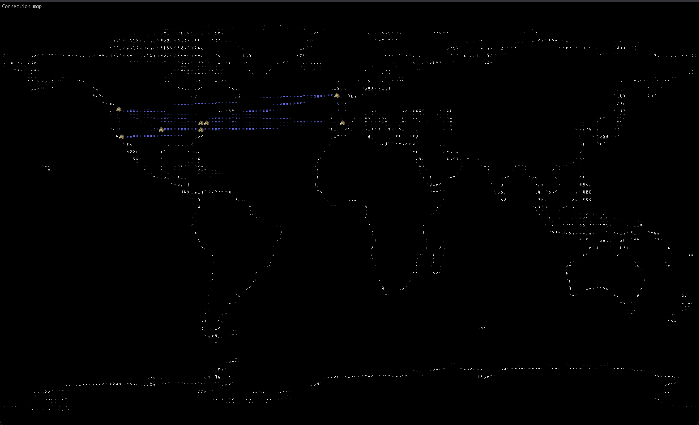

# Maperick


Show active TCP connections on a TUI world map. Still WIP, but it's gonna be good.




## Setup

```
git clone git@github.com:schlunsen/maperick.git
cd maperick/

# Run maperick
cargo run 

# build maperick
cargo build --release

# See https://github.com/P3TERX/GeoLite.mmdb for mmdb files
./target/release/maperick -e -p GeoLite2-City.mmdb 
```

[See this repo for mmdb files](https://github.com/P3TERX/GeoLite.mmdb)
---


Dependencies
------------
* Maxmind
* rs-tui
* netstat rust


### Todo

- [x] Base setup
- [x] Replace argh with clap
- [x] Add netstat retrieval of open connections and their ip
- [x] Error handling maxdb
- [x] Add maxmind geolookup
- [x] Refactor netstats methods to module
- [x] Display connected ips in table
- [ ] Refactor on_tick code into modules
- [ ] Add new tab with configuration options
- [ ] Add host public_ip as different marker on map
- [ ] Add ip's to ignore in configuration
- [ ] Write simple tests
- [ ] Add to Brew Formulae
- [ ] Better README
